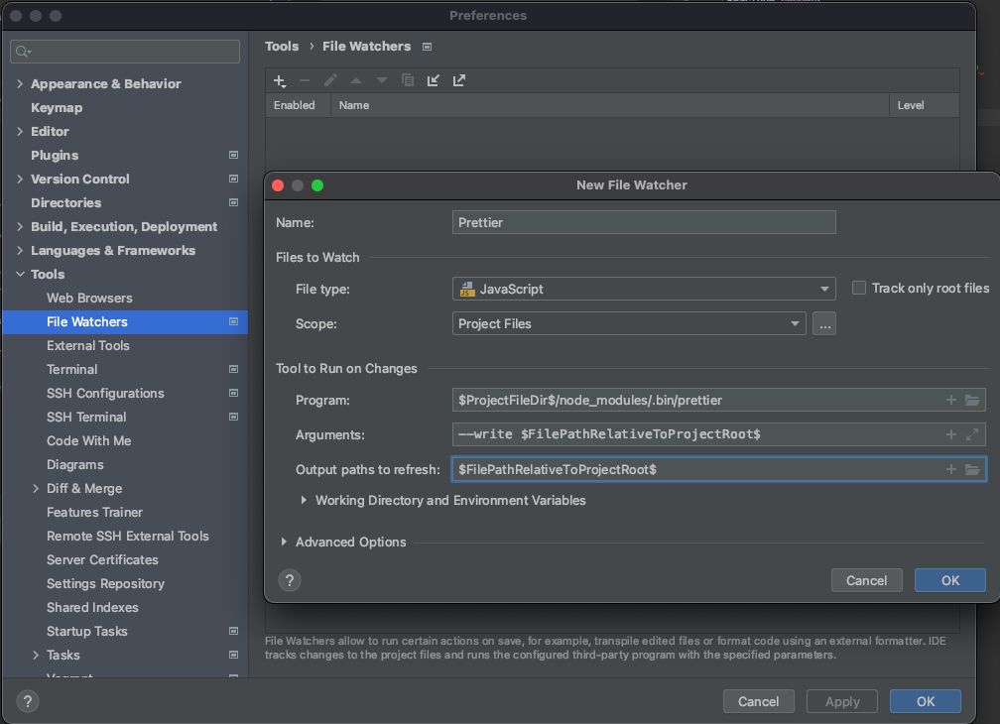
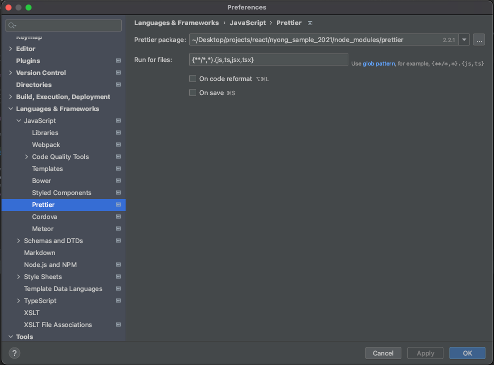

# Nyong Test App 2021

Create new app for Web Study

## Create Application Command Line

$ npx create-react-app nyong_sample_2021

## Install React Prop Types

$ npm i prop-types

## For WebStorm User

### Install ESLint

1. npm i eslint --save-dev
2. eslint -g ./node_modules/.bin/eslint --init

- Questions

```
1. How would you like to use ESLint?
To check syntax and find problems (style)
2. Waht type of modules does your project use?
JavaScript modules (esm)
3. Which framework does your project use?
React (react)
4. Does your porject use TypeScript?
Yes
4. Where does your code run?
Browser (browser)
5. How would you like to define a style for your project?
Use a popular style guide (guide)
6. Which style guide do you want to follow?
Airbnb (airbnb)
7. What format do you want your config file to be in?
JSON
8. Would you like to install them now with npm?
Yes
```

Result: .eslintrc.json

```
"rules" : {
  + "no-console" : "off",
    "react/jsx-filename-extension": [1, { "extensions": [".js", ".jsx"] }]
}
```

## Babel, ESlint Setting

$ npm install --save-dev babel-eslint

```
{
 + "parser" : "babel-eslint"
   "rules" : {
     ...
   }
}
```

https://www.jetbrains.com/help/webstorm/eslint.html

## Install Prettier

https://prettier.io/docs/en/install.html
https://prettier.io/docs/en/configuration.html

### $ npm i --save-dev --save-exact prettier

Shortcut : Cmd + Opt + Shift + P



- Program : $ProjectFileDir$/node_modules/.bin/prettier
- Arguments : --write $FilePathRelativeToProjectRoot$
- Output paths to refresh : $FilePathRelativeToProjectRoot$

### Check Preference

## Setting Prettier 

### .prettierrc.json

```
{
  "trailingComma": "es5",
  "tabWidth": 2,
  "semi": false,
  "singleQuote": true
}


```



## ESLint, Prettier Settings (두개를 혼용해서 사용하는 경우)

$ npm i --save-dev eslint-config-prettier

### .eslintrc.json

```
{
    "extends": [
        "plugin:react/recommended",
        "airbnb",
        "prettier"
    ],
}

```
